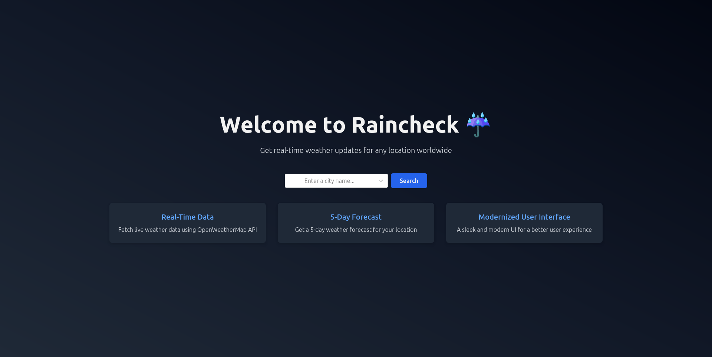
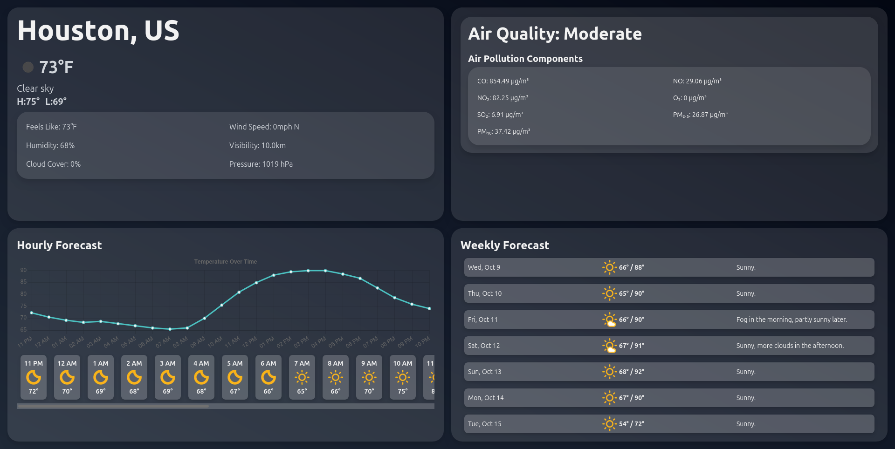
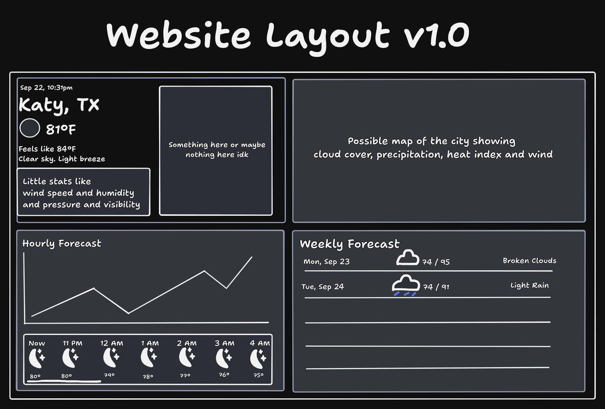

<h1>Raincheck ☔</h1>
</a>
Raincheck ☔ is a small web app that displays the current weather and forecast in any location in the world.
 

### Live demo at [weather.j21.dev](https://weather.j21.dev)
 

 
  
  

The aim of this project is to practice my front-end dev skills and visualization of data across multiple screen sizes.

## Bug Reporting
If you encounter any strange bugs on the website, please let me know by going to [issues](https://github.com/Jeydin21/Raincheck/issues/) and create a bug report.

## Images

Initial Project Plan

## Tech Stack
### Front-end:
- [React.js](https://react.dev/)
- [Next.js](https://nextjs.org/)
- [Tailwind CSS](https://tailwindcss.com/)
### Back-end:
- [OpenWeather API](https://openweathermap.org/api/)
- [Meteosource API](https://www.meteosource.com/)

## Local Development
TBD

## License
This project is licensed under the [MIT License](https://opensource.org/license/mit) - see the [License](https://github.com/Jeydin21/Raincheck/blob/main/LICENSE) file for more details